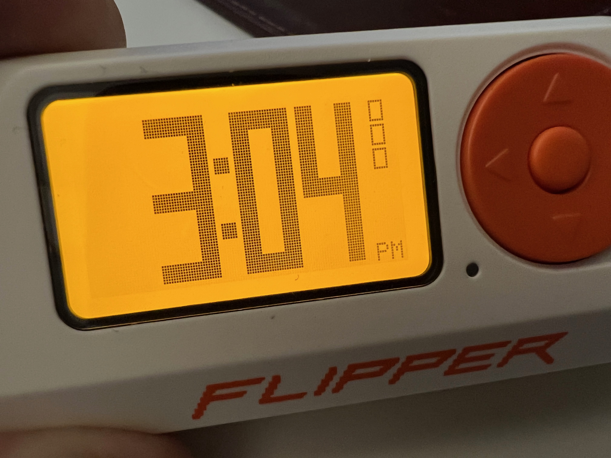

# flipper-bigclock

A full-screen “big digit” clock app for Flipper Zero, built with **uFBT**.



## What it does
- Displays time in **12-hour** format with a small **AM/PM** indicator
- Updates once per second
- Forces the **backlight to stay on** while the app is running
- **BACK** (short press) exits

## Do I need a Python .venv?
Not strictly.

- If `ufbt` is installed globally (or via `pipx`), you can just run `ufbt` without any venv.
- If you installed `ufbt` into a venv, then you *do* need to activate that venv before building.

Quick sanity check:
```sh
which ufbt
ufbt -h
```

If `which ufbt` points inside a `.venv/` path, activate that venv first:
```sh
source ../.venv/bin/activate
```

## Build + run (uFBT)

### Build
```sh
ufbt
```

### Install + run on device (USB)
```sh
ufbt launch
```

### Run in emulator
```sh
ufbt emu
```

### Clean
```sh
ufbt clean
```

## Repo notes
- Source: `bigclock.c`
- Manifest: `application.fam`
- Assets: `images/` (compiled into the app)
- Docs: `docs/` (screenshots, etc.)
- Build outputs (not committed): `dist/`
