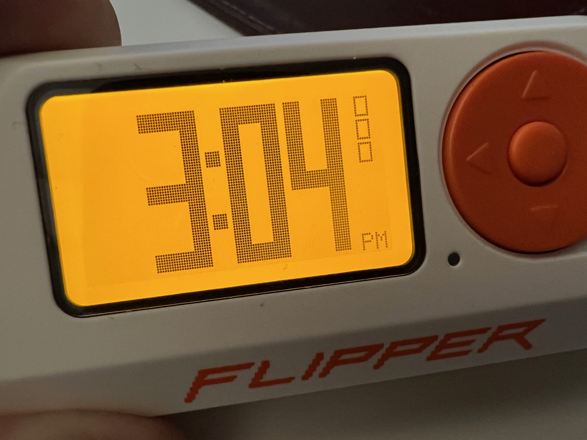

# flipper-bigclock

A full-screen big-digit clock app for Flipper Zero, built with **uFBT**.



## What this project is
`bigclock` is a simple, fast, always-on-display clock for Flipper Zero:
- Full-screen HH:MM digits
- 12h and 24h modes
- Three visual digit styles
- One-second updates from RTC
- Backlight forced on while the app is active

The design goal is a readable clock with tweakable visuals, especially the bitmap font mode.

## Controls
- `OK` short press: toggle `12h` / `24h`
- `OK` long press: cycle digit style
  - `Classic` (block 7-seg)
  - `Lozenge` (angled segment ends)
  - `Font` (manual bitmap digits 0..9)
- `BACK` short press: exit app

## Font mode (manual digit tuning)
Font mode uses an editable table in `bigclock.c`:
- `font_digits[10][64][25]`
- One block per digit (`0..9`)
- 64 rows tall
- 24 visible columns per row (`.` off, `X` on)

This is intentionally hand-edit-friendly so digit shapes can be refined directly in source.

## Persisted settings
The app saves preferences under app data:
- `mode24.bin` -> `12h` / `24h` mode
- `segment_style.bin` -> selected style (`0`, `1`, `2`)

## Build and deploy
If `ufbt` is in a virtual environment, activate it first:
```sh
source ~/venvs/ufbt/bin/activate
```

Build:
```sh
ufbt build
```

Build + upload + launch on connected Flipper:
```sh
ufbt launch
```

Optional:
```sh
ufbt clean
ufbt emu
```

## Project files
- Main source: `bigclock.c`
- Manifest: `application.fam`
- Docs/assets: `docs/`, `images/`
